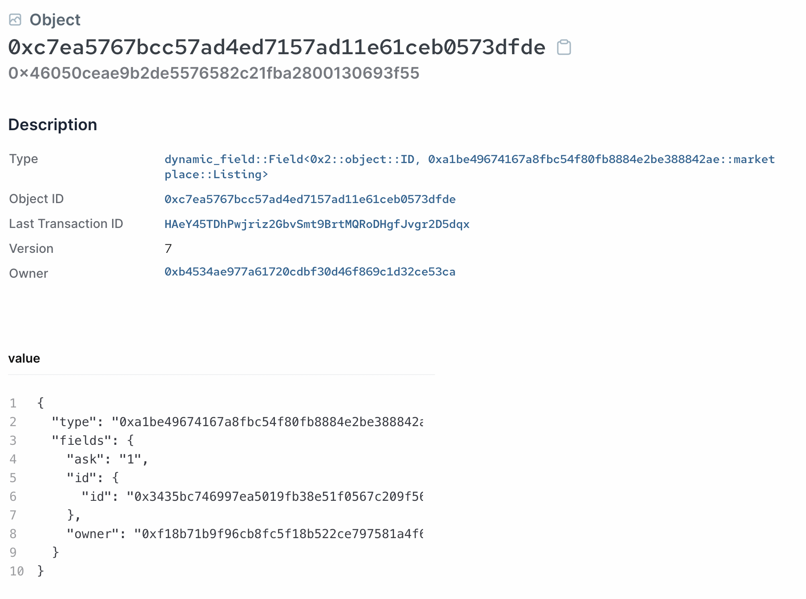

# Deployment and Testing

Next we can deploy and test our marketplace contract through the SUI CLI. 

We create a simple `marketplace::widget` module so we can mint some items for us to list to help with test.

```rust
module marketplace::widget {

    use sui::object::{Self, UID};
    use sui::transfer;
    use sui::tx_context::{Self, TxContext};

    struct Widget has key, store {
        id: UID,
    }

    public entry fun mint(ctx: &mut TxContext) {
        let object = Widget {
            id: object::new(ctx)
        };
        transfer::transfer(object, tx_context::sender(ctx));
    }
}
```

This is basically the Hello World project from Unit One, but made even simpler. 

## Deployment

First we publish both the package with:

```bash
    sui client publish --gas-budget 3000
```

You should see both `marketplace` and `widget` modules published on the explorer: 


Export the package object ID into an environmental variable:

```bash
    export PACKAGE_ID=<package object ID from previous output>
```

## Initialize the Marketplace

Next, we need to initialize the marketplace contract by calling the `create` entry function. We want to pass it a type argument to specify which type of fungible token this marketplace will accept. It's easiest to just use the `Sui` native token here. We can use the following CLI command: 

```bash
    sui client call --function create --module marketplace --package $PACKAGE_ID --type-args 0x2::sui::SUI --gas-budget 1000
```

Note the syntax for passing in the type argument for `SUI` token. 

Export the `Marketplace` shared object's ID into an environmental variable:

```bash
    export MARKET_ID=<marketplace shared object ID from previous output>
```

## Listing

First, we mint a `widget` item to be listed:

```bash
    sui client call --function mint --module widget --package  $PACKAGE_ID --gas-budget 1000
```

Then we list this item to our marketplace:

```bash
sui client call --function list --module marketplace --package $PACKAGE_ID --args $MARKET_ID <Widget item ID> 1 --type-args $PACKAGE_ID::widget::Widget 0x2::sui::SUI --gas-budget 1000
```

We need to submit two type arguments here, first is the type of the item to be listed and second is the fungible coin type for the payment. The above example uses a listing price of `1`. 

After submitting this transaction, you can check the newly created listing on [the Sui explorer](https://explorer.sui.io/):



## 