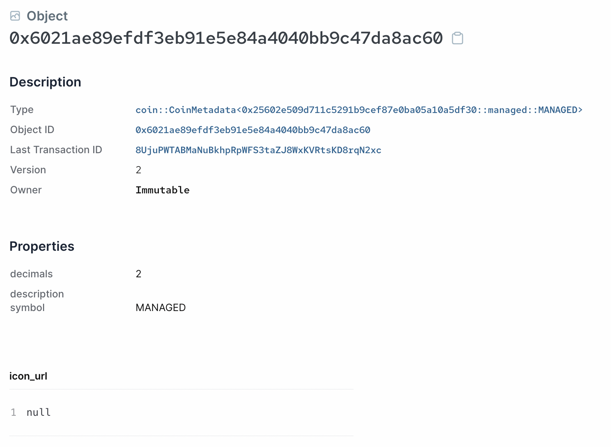
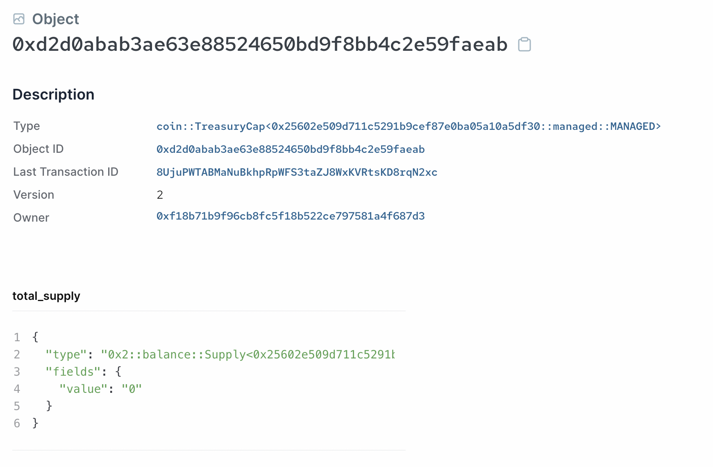

# Managed Coin Example

Now we have peeked under the hood of the `sui::coin` module, we can look at a simple, but complete example of creating a type of custom fungible token where there is a trusted manager that has the capability to mint and burn, similar to many ERC-20 implementations. 

## Smart Contract

You can find the complete [Managed Coin contract](https://github.com/MystenLabs/sui/blob/main/sui_programmability/examples/fungible_tokens/sources/managed.move) below:

```rust
// Copyright (c) Mysten Labs, Inc.
// SPDX-License-Identifier: Apache-2.0

/// Example coin with a trusted manager responsible for minting/burning (e.g., a stablecoin)
/// By convention, modules defining custom coin types use upper case names, in contrast to
/// ordinary modules, which use camel case.
module fungible_tokens::managed {
    use std::option;
    use sui::coin::{Self, Coin, TreasuryCap};
    use sui::transfer;
    use sui::tx_context::{Self, TxContext};

    /// Name of the coin. By convention, this type has the same name as its parent module
    /// and has no fields. The full type of the coin defined by this module will be `COIN<MANAGED>`.
    struct MANAGED has drop {}

    /// Register the managed currency to acquire its `TreasuryCap`. Because
    /// this is a module initializer, it ensures the currency only gets
    /// registered once.
    fun init(witness: MANAGED, ctx: &mut TxContext) {
        // Get a treasury cap for the coin and give it to the transaction sender
        let (treasury_cap, metadata) = coin::create_currency<MANAGED>(witness, 2, b"MANAGED", b"", b"", option::none(), ctx);
        transfer::freeze_object(metadata);
        transfer::transfer(treasury_cap, tx_context::sender(ctx))
    }

    /// Manager can mint new coins
    public entry fun mint(
        treasury_cap: &mut TreasuryCap<MANAGED>, amount: u64, recipient: address, ctx: &mut TxContext
    ) {
        coin::mint_and_transfer(treasury_cap, amount, recipient, ctx)
    }

    /// Manager can burn coins
    public entry fun burn(treasury_cap: &mut TreasuryCap<MANAGED>, coin: Coin<MANAGED>) {
        coin::burn(treasury_cap, coin);
    }

    #[test_only]
    /// Wrapper of module initializer for testing
    public fun test_init(ctx: &mut TxContext) {
        init(MANAGED {}, ctx)
    }
}

```

Given what we have covered so far, this contract should be very easy to understand. It follows the [One Time Witness](./3_witness_design_pattern.md#one-time-witness) pattern, where the `witness` resource is named `MANAGED`, and automatically created by the module `init` function. 

The `init` function then calls `coin::create_currency` to get the `TreasuryCap` and `CoinMetadata` resources.

The `CoinMetadata` is then frozen via the `transfer::freeze_object` method, so that it becomes a [shared immutable object](../../unit-two/lessons/2_ownership.md#shared-immutable-objects) that can be read by any address. 

Then the `TreasuryCap` [Capability](../../unit-two/lessons/6_capability_design_pattern.md) object is used as a way to control access to the `mint` and `burn` methods that create or destroy `Coin<Managed>` objects respectively. 

## Publishing and CLI Testing

Under the [fungible_tokens](../example_projects/fungible_tokens/) project folder, run:

```bash
    sui client publish --gas-budget 30000
```

You should see console output similar to:


The two immutable objects created are respectively the package itself, `CoinMetadata` of Managed Coin. And the owned object is the `TreasuryCap` object of Managed Coin. 





